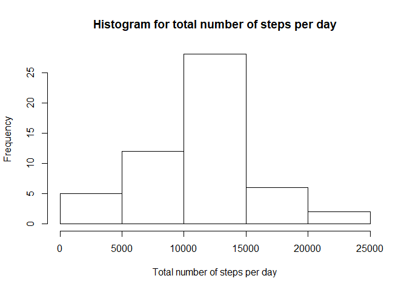
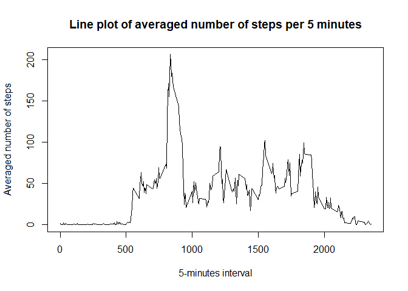
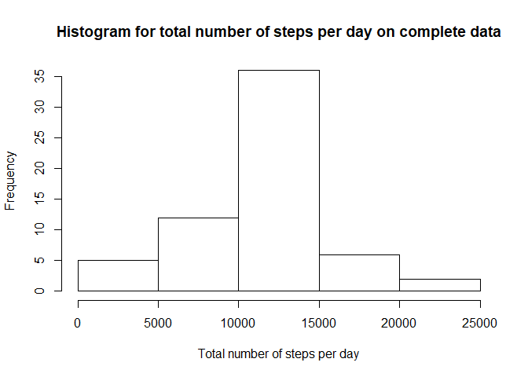
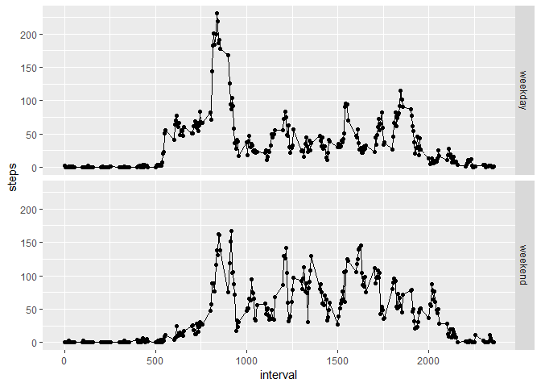

```r
##Loading and preprocessing the data
data <- read.csv("activity.csv",stringsAsFactors=FALSE, header=TRUE, sep=',', na.strings = 'NA')
print(head(data))
```

```
##   steps       date interval
## 1    NA 2012-10-01        0
## 2    NA 2012-10-01        5
## 3    NA 2012-10-01       10
## 4    NA 2012-10-01       15
## 5    NA 2012-10-01       20
## 6    NA 2012-10-01       25
```


```r
##What is mean total number of steps taken per day?
data_na_removed <- data[complete.cases(data),]
total_steps_per_day <- aggregate(data_na_removed$steps,by=list(date=data_na_removed$date),FUN=sum)
hist(total_steps_per_day$x,
     main="Histogram for total number of steps per day", 
     xlab="Total number of steps per day")
```

<!-- -->

```r
#Calculate and report the mean and median of the total number of steps taken per day
summary(total_steps_per_day$x)
```

```
##    Min. 1st Qu.  Median    Mean 3rd Qu.    Max. 
##      41    8841   10765   10766   13294   21194
```


```r
##What is the average daily activity pattern?
averaged_steps_per_5_minutes <- aggregate(data_na_removed$steps,by=list(interval=data_na_removed$interval),FUN=mean)
x_plot <- averaged_steps_per_5_minutes$interval
y_plot <- averaged_steps_per_5_minutes$x
plot(x_plot, y_plot, type='l', main="Line plot of averaged number of steps per 5 minutes",
     xlab="5-minutes interval",
     ylab="Averaged number of steps")
```

<!-- -->

```r
#Which 5-minute interval, on average across all the days in the dataset, contains the maximum number of steps?
print(averaged_steps_per_5_minutes[which.max(y_plot),])
```

```
##     interval        x
## 104      835 206.1698
```


```r
##Imputing missing values
#Total number of missing values
print(sum(is.na(data$steps)))
```

```
## [1] 2304
```

```r
#Filling in all of the missing values
missing_values <- data[is.na(data$steps),]
for(i in 1:nrow(missing_values)){
        missing_values[i,1] <- averaged_steps_per_5_minutes[(averaged_steps_per_5_minutes$interval==missing_values[i,3]),2]
}
#Create a new dataset that is equal to the original dataset but with the missing data filled in
complete_data <- data
complete_data[is.na(complete_data$steps),1] <- missing_values$steps
print(head(complete_data))
```

```
##       steps       date interval
## 1 1.7169811 2012-10-01        0
## 2 0.3396226 2012-10-01        5
## 3 0.1320755 2012-10-01       10
## 4 0.1509434 2012-10-01       15
## 5 0.0754717 2012-10-01       20
## 6 2.0943396 2012-10-01       25
```

```r
#histogram of complete data
total_steps_per_day_complete <- aggregate(complete_data$steps,by=list(date=complete_data$date),FUN=sum)
hist(total_steps_per_day_complete$x,
     main="Histogram for total number of steps per day on complete data", 
     xlab="Total number of steps per day")
```

<!-- -->

```r
#summary of complete data
summary(total_steps_per_day_complete$x)
```

```
##    Min. 1st Qu.  Median    Mean 3rd Qu.    Max. 
##      41    9819   10766   10766   12811   21194
```

```r
#Mean and median keep unchanged while the height of histogram becomes larger as more data involved
```


```r
#Create a new factor variable
complete_data$day <- factor(weekdays(as.Date(complete_data$date)) %in% c("Saturday","Sunday"),labels=c("weekday","weekend"))
#Panel plot
averaged_steps_per_5_minutes_weekday <- aggregate(complete_data$steps,by=list(day=complete_data$day,interval=complete_data$interval),FUN=mean)
colnames(averaged_steps_per_5_minutes_weekday) <- c("day","interval","steps")
library(ggplot2)
qplot(interval,steps,data=averaged_steps_per_5_minutes_weekday,facets = day~.)+geom_line()
```

<!-- -->
